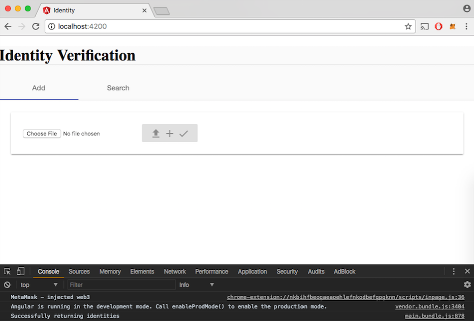
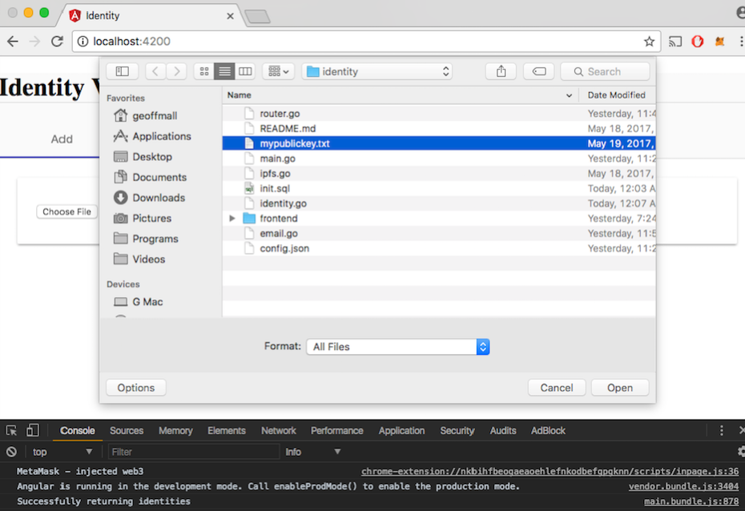
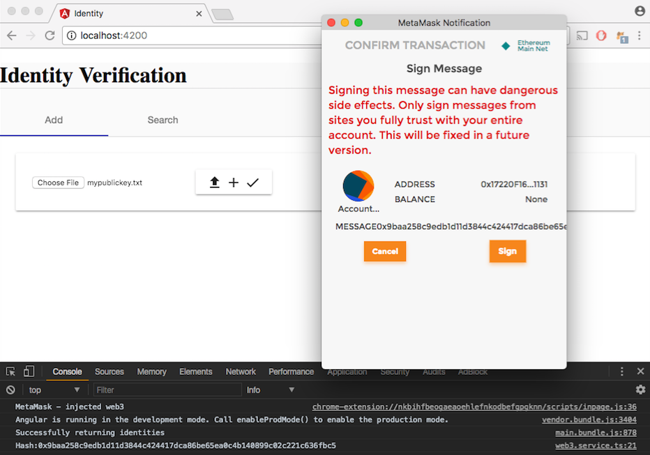
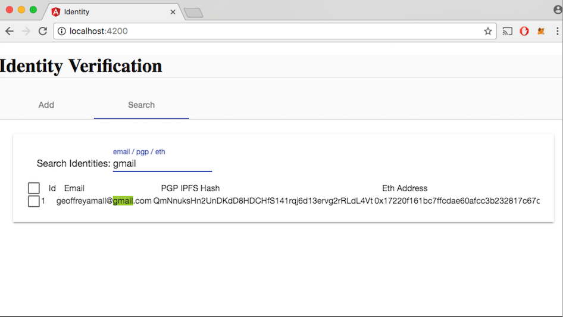

# Identity Database

Creates a 'fingerprint' for a user by linking their PGP key and Ethereum address.

[Live Demo](http://54.67.117.89/)

`git clone https://github.com/GeoffMall/identity.git`

> [http://localhost:4200](http://localhost:4200)

### How it works

*   User uploads their pgp key and clicks check button

    *   ###### Behind the scenes
    
    *   Validates PGP key file
    *   Uploads file to IPFS and returns hashed address
    *   Parses PGP key and obtains email
    *   Obtains Ethereum address using Metamask
    *   Signs Ethereum address with current time with web3
    *   Verifies message signature
    *   Saves IPFS hash, Ethereum address, and email into database
    
*   User searches and filters identities in database showing IPFS hash, Ethereum address, and email

### Technology used

*   Angular
*   Golang
*   IPFS
*   [Metamask](https://metamask.io/)
*   MySQL

### Running

Before starting make sure command line recognizes `go`, `ng`, `npm`, and `ipfs`.

#### MySQL

*   `mysql -u root < init.sql`

#### IPFS

*   `brew install ipfs`  - if no ipfs
    
*   `ipfs init`
    
*   `ipfs daemon`

#### Frontend

*   `cd frontend`

*   `npm install`

*   `ng serve`

#### Backend

*   `go get -v`

*   `go run *.go`

#### Additional notes

*   We gain access to [http://localhost:5001/webui](http://localhost:5001/webui) since we are running IPFS. 
There are quite a lot of useful endpoints here.

*   Metamask needs to be unlocked to sign [src](https://github.com/ethereum/wiki/wiki/JavaScript-API#web3ethsign)

*   Have to deal with [ecrecover v value issue](https://github.com/ethereum/wiki/wiki/JavaScript-API#returns-45_)

#### Some screen shots from UI

